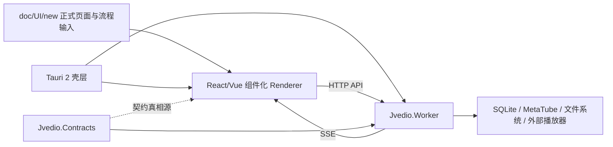

## 用户需求

- 重新定义项目现状：当前项目仍处于旧桌面实现向新桌面实现迁移阶段，过渡桌面壳已覆盖大部分页面与主流程，本地业务服务只剩少量收口工作。
- 今天内将把 `doc/UI/new/` 下的页面、弹层、共享组件和流程图全部确定为正式输入物，后续方案必须以这批文档和图为唯一 UI 依据。
- 不再沿用当前过渡桌面壳方案作为后续主线，需要先输出一份全新的迁移与重构方案供审查。
- 旧文档里与特定外部参考源相关的内容不再保留，应从新方案中移除，并纳入后续统一清理范围。
- 新方案允许有限参考 `clash-verge-rev` 的部分 UI 组织形式，例如左侧导航层级、设置页左右分栏排版、桌面壳布局节奏；但这类参考仅用于界面组织表达，不继承其产品信息架构、业务流转、后端实现或契约边界。
- 在输出完整版迁移文档前，需先审查并收敛 `plan/` 目录的工件组织，移除仅为早期 `opencode cli` agent 工作流服务的冗余文档约束，改为适配当前 `CodeBuddy / Codex` 的轻量 planning 结构。
- 当前先做方案审查，不立即决定具体写入哪些仓库文件。

## 产品概览

- 新方案应把现有页面范围完整承接下来，包括库管理、媒体库内容、影片详情、演员、收藏、类别、系列、设置与任务反馈。
- 页面视觉和交互不再重新发散设计，而是以已定稿的白底线框、页面规格、弹层规格、共享组件规则和流程图为准。
- 方案重点是重新组织桌面壳、前端层、本地业务层和共享契约层的边界，而不是重做产品范围。

## 核心功能

- 产出一份全新的迁移主线文档，替换当前以过渡桌面壳为核心的叙事。
- 明确哪些能力继续保留、哪些实现需要替换、哪些旧参考内容需要退出文档主线。
- 给出新的阶段路线、验证矩阵、回退策略和风险控制，确保迁移可审查、可执行、可逐步切换。
- 对前端框架给出审查用双路径方案，并提供默认推荐路线。

## Tech Stack Selection

基于当前仓库已验证的实现与用户新方向，推荐的新主线为：

- 桌面壳：`Tauri 2`
- 前端：`TypeScript + React` 为默认推荐；`TypeScript + Vue` 作为备选路径
- 本地业务层：继续保留 `Jvedio-WPF/Jvedio.Worker`
- 契约层：继续保留 `Jvedio-WPF/Jvedio.Contracts`
- 数据与事件通信：继续保留 `localhost API + SSE`
- 旧过渡实现：`electron/` 进入退场期，不再作为后续文档主叙事

已确认的代码事实：

- `Jvedio.Worker/Program.cs` 当前以本地 HTTP 宿主方式运行，监听 `127.0.0.1`
- `Jvedio.Worker/Controllers/EventsController.cs` 已提供 SSE 事件流
- `electron/renderer/src/api/client/apiClient.ts` 已证明当前 API 合同可直接被前端消费
- `doc/UI/new/` 已是当前正式 UI 文档入口
- 当前 planning 文档仍大量绑定 `Electron` 与 `fntv-electron` 叙事，需要整体重写而不是局部修补

## Implementation Approach

### 总体策略

采用“**壳层替换，业务保留，前端重建，契约优先**”的方式推进：

1. 丢弃当前文档中的 Electron 主线叙事；
2. 保留 `Worker + Contracts + API + SSE` 作为稳定底座；
3. 用 `Tauri 2` 接管桌面壳与系统桥接；
4. 用组件化前端重建 renderer，不继续沿用当前 `HomePageController + innerHTML` 结构。

### 方案路径

#### 路径 A：`Tauri 2 + React + TypeScript`（推荐）

- 适用场景：
- 更重视组件生态、AI 生成效率、列表页与复杂交互的长期维护性
- 更希望沿用当前 TypeScript 心智和常见桌面 Web 工程结构
- 优点：
- 组件复用、状态拆分、测试隔离更成熟
- 更适合大页面、复杂筛选、任务反馈、详情联动
- 更利于后续引入查询缓存、虚拟列表、局部刷新
- 风险：
- 需要完整重建 renderer，不能平移当前大控制器代码

#### 路径 B：`Tauri 2 + Vue + TypeScript`

- 适用场景：
- 团队后续更偏好 SFC 写法和模板表达
- 更希望以较低样板代码组织页面
- 优点：
- 页面结构表达直观
- 对表单、设置页、抽屉弹层类页面开发体验较好
- 风险：
- 与当前手写 TypeScript renderer 的迁移连续性更弱
- 现有代码无法直接复用，仍需整体重建

### 默认建议

- 默认采用 **路径 A（React）**
- 理由：
- 当前 renderer 已是 TypeScript 代码形态，React 迁移思路更顺滑
- 更适合后续大库分页、筛选、任务状态、详情返回链路等复杂页面
- 与此前仓库中已验证的 API/SSE 消费方式兼容性更高

### 性能与可靠性

- 重业务继续留在 `Worker`，避免把扫描、抓取、图片写出、播放器调用迁入壳层
- 列表页按分页与可见区域渲染，避免 500+ 影片一次性重绘
- 任务、库变化、设置变化继续走 SSE 增量刷新，避免反复全量轮询
- 复杂度目标：
- 页面渲染复杂度控制在 `O(pageSize)`
- 任务反馈与详情刷新优先走局部更新，避免整页反复重取
- 主要瓶颈仍是：
- 扫描导入 IO
- 图片与缩略图读取
- 详情页资源加载
- 大库筛选与排序查询
- 缓解策略：
- 保持 Worker 查询边界不扩大
- 前端引入查询缓存、失效刷新、分页缓存
- 大图与详情内容延后加载

## Implementation Notes

- 当前 `electron/renderer/src/api/client/apiClient.ts`、`app/routes/router.ts`、`features/home/useHomePageData.ts` 已证明“前端消费 Worker API/SSE”链路成立；新方案应复用这条通信边界，而不是重写 Worker 合同。
- 当前 `Jvedio.exe` 的 Release 入口已经切到 Electron 壳；新方案必须补一条“**Tauri 通过验证前，不删除 Electron 退路**”的过渡策略，降低切换爆炸半径。
- `doc/UI/new/` 已是正式 UI 输入，本轮方案应把它从“Electron 实施入口”改写为“新桌面壳统一 UI 输入”。
- 可参考 `clash-verge-rev` 的局部桌面 UI 组织方式，例如左侧导航层级、设置页左右分栏、壳层级布局与桌面交互节奏；但仅限视觉组织与页面编排参考，不覆盖 `doc/UI/new` 已冻结的页面职责、流转关系、共享组件规则和数据边界。
- `fntv-electron` 相关参考内容当前存在于 `plan.md`、`handoff.md`、`implementation-steps.md`、`.plan-original.md`、`doc/CHANGELOG.md` 等文档；新方案落库时要统一清退，避免新旧叙事并存。
- `open-questions.md` 当前仅剩“Worker 固定端口还是动态端口”未决；新方案应保留此问题，并新增“React/Vue 最终锁定”这一审查项。
- 为控制技术债，本轮不建议：
- 把现有 Worker 全量迁入 Rust
- 把所有业务 API 改成 Tauri command
- 在同一阶段长期并行维护 Electron 与 Tauri 两套正式壳

## Architecture Design

### 目标结构

- `Tauri 2`：只负责窗口、单实例、文件对话框、系统菜单、托盘、自动更新、Worker 拉起与关闭
- 组件化 renderer：只负责路由、页面、交互、局部状态、表单、任务态展示
- `Jvedio.Worker`：继续负责数据库、扫描、抓取、sidecar、播放器调用、任务编排
- `Jvedio.Contracts`：继续作为 DTO、事件、错误模型的唯一真相源

### 分层说明

- 表现层：`AppShell`、路由、页面组件、弹层、共享组件
- 应用层：页面级 hooks/composables、查询封装、命令触发、任务订阅
- 适配层：
- 前端侧 `api client`
- 壳层侧 Tauri command/bridge
- 业务层：`Controller → Service → Orchestrator`
- 契约层：DTO、事件 envelope、错误码

### 状态模型

- 服务端状态：
- 库列表、任务摘要、影片结果集、演员详情、设置快照
- 统一按“查询缓存 + 失效刷新 + SSE 增量更新”管理
- 本地 UI 状态：
- 筛选草稿
- 弹层开关
- 返回态
- 页签态
- 局部 loading / submitting 状态

## Directory Structure

### 目录收敛判断

当前仓库中的 `plan/` 结构带有明显的早期 `opencode cli` 规划痕迹：同一 active feature 下同时维护 `plan.md`、`handoff.md`、`implementation-steps.md`、`validation.md`、`open-questions.md`、`.plan-original.md`、`plan.json`，职责有较大重叠。

基于当前已切换到 `CodeBuddy / Codex` 客户端工作的事实，新方案**不必继续严格遵守**这套重工件模式；可以调整为“**少量核心文档 + 可选附属文档**”的轻量 planning 结构。

### 推荐的目标结构

推荐将 active feature 收敛为以下组织：

- `plan/active/<feature>/plan.md`
- 用途：唯一的人类可读主方案文档
- 承载：项目现状、目标架构、方案路径、阶段路线、验证策略、退场策略、落库范围
- 规则：后续不再把关键信息拆散到多个平级执行文档里

- `plan/active/<feature>/handoff.md`
- 用途：新会话恢复入口
- 承载：当前真实状态、最近结论、下一步建议、关键约束
- 规则：保持短小，避免再次膨胀成第二份 `plan.md`

- `plan/active/<feature>/open-questions.md` `[OPTIONAL]`
- 用途：只记录真正未冻结、且会影响方案或实现边界的问题
- 规则：若无真实未决项，可删除，不再为了流程完整性强行保留

- `plan/active/<feature>/validation.md` `[OPTIONAL]`
- 用途：仅当验证矩阵较大、需要独立维护时保留
- 规则：如果验证规模不大，可并回 `plan.md`

### 建议降级或移除的工件

- `implementation-steps.md` `[MERGE or REMOVE]`
- 判断：其内容与 `plan.md` 的阶段路线高度重叠
- 建议：合并进 `plan.md` 的“阶段路线 / 实施顺序”章节；仅当存在真正操作性 runbook 时才独立保留

- `.plan-original.md` `[REMOVE]`
- 判断：在已有 Git 历史与当前客户端 planning 工件的前提下，价值已明显下降
- 建议：后续不再为每个 feature 维护该文件；历史文件可归档，不再继续复制

- `plan.json` `[TOOL-ONLY or REMOVE]`
- 判断：它更像旧 planning 系统的状态镜像，而不是当前人工阅读入口
- 建议：如果当前没有自动化明确消费它，就停止把它作为人工维护目标；若仍需保留，也应视为工具侧元数据，不再承载正文叙事

### templates 目录的处理原则

- `plan/templates/` 可以继续保留，但应同步简化为轻量模板
- 推荐仅保留：
- `plan.md`
- `handoff.md`
- 可选 `validation.md`
- 不建议继续把 `.plan-original.md` 和 `plan.json` 作为默认模板要求

### 已确认需要重写或更新的现有文档

- `d:/MyProjects/JVedio/plan/active/desktop-ui-shell-refactor/plan.md` `[MODIFY]`
- 用途：替换当前 Electron 主线规划，并吸收原 `implementation-steps.md` 中仍有价值的阶段信息
- 要求：删除 `fntv-electron` 主叙事，改写为 Tauri 主线、双路径方案、阶段路线、验证矩阵、退场策略

- `d:/MyProjects/JVedio/plan/active/desktop-ui-shell-refactor/handoff.md` `[MODIFY]`
- 用途：作为后续新会话的唯一入口
- 要求：改为“Tauri 主线 + 当前真实状态 + 下一步决策”，并显著缩短

- `d:/MyProjects/JVedio/plan/active/desktop-ui-shell-refactor/open-questions.md` `[MODIFY / OPTIONAL]`
- 用途：保留审查前未决项
- 要求：只保留真正需要用户确认的项，如 React/Vue、端口策略、Tauri 壳目录命名；如果这些问题被冻结，可直接移除该文件

- `d:/MyProjects/JVedio/plan/active/desktop-ui-shell-refactor/validation.md` `[KEEP or MERGE]`
- 用途：保留独立验证矩阵，或在简化时并回 `plan.md`
- 要求：若继续存在，应移除 Electron 叙事，转成 Tauri 主线验证矩阵

- `d:/MyProjects/JVedio/plan/active/desktop-ui-shell-refactor/implementation-steps.md` `[DEPRECATE]`
- 用途：旧执行顺序说明
- 要求：不再作为默认长期工件；其有效内容应并入 `plan.md`

- `d:/MyProjects/JVedio/doc/CHANGELOG.md` `[MODIFY]`
- 用途：记录主线切换与旧参考清退
- 要求：说明 Electron 规划退场、Tauri 重构方案进入审查阶段

### 已确认需要同步口径的 UI 文档入口

- `d:/MyProjects/JVedio/doc/UI/new/README.md` `[MODIFY]`
- `d:/MyProjects/JVedio/doc/UI/new/page-index.md` `[MODIFY]`
- `d:/MyProjects/JVedio/doc/UI/new/ui-todo.md` `[MODIFY]`
- 用途：统一说明这批文档是新桌面壳唯一 UI 输入
- 要求：去掉 Electron 实施语义，保留页面/弹层/共享组件/流程的正式输入定位

### 已确认会受影响的现有实现入口

- `d:/MyProjects/JVedio/Jvedio-WPF/Jvedio/App.xaml.cs` `[LATER MODIFY]`
- 用途：Release 启动入口
- 要求：未来从 `electron-shell` 切换到新壳，并保留安全回退

- `d:/MyProjects/JVedio/Jvedio-WPF/Jvedio/Jvedio.csproj` `[LATER MODIFY]`
- 用途：Release 打包与产物复制
- 要求：未来将产物复制链从 Electron 改到新壳

- `d:/MyProjects/JVedio/Jvedio-WPF/Jvedio.Worker/Program.cs` `[KEEP / MINOR MODIFY]`
- 用途：Worker 宿主与端口策略
- 要求：冻结固定端口或动态端口方案

- `d:/MyProjects/JVedio/Jvedio-WPF/Jvedio.Worker/Controllers/EventsController.cs` `[KEEP]`
- 用途：SSE 事件流
- 要求：继续作为任务与状态广播入口

- `d:/MyProjects/JVedio/Jvedio-WPF/Jvedio.Contracts/` `[KEEP / MINOR MODIFY]`
- 用途：DTO / 事件 / 错误模型真相源
- 要求：继续作为跨层合同来源，不被壳层替代

- `d:/MyProjects/JVedio/electron/` `[DEPRECATE]`
- 用途：当前过渡壳实现
- 要求：进入退场期；在 Tauri 通过验证前保留回退，不再继续扩写规划主线

## 方案路径结论

- 审查阶段推荐：**路径 A，React 主线**
- 保留：`Worker + Contracts + API + SSE`
- 替换：`Electron main/preload/renderer 实现与打包主线`
- 删除：所有 `fntv-electron` 作为后续主线参考的文档叙事
- 暂缓：新壳工程目录名与最终落库文件清单，待你审查通过后再冻结

## Agent Extensions

### SubAgent

- **code-explorer**
- Purpose: 全仓搜索旧 `Electron` / `fntv-electron` 叙事残留、受影响 planning 文档和实现入口
- Expected outcome: 形成完整清理清单，保证新主线落库时不会遗漏旧参考内容