# 配置与持久化

## 范围

| 区域 | 文件 |
|--|--|
| 配置总入口 | `Jvedio-WPF/Jvedio/Core/Config/ConfigManager.cs` |
| 路径管理 | `Jvedio-WPF/Jvedio/Core/Config/PathManager.cs` |
| 数据库路径 | `Jvedio-WPF/Jvedio/Core/DataBase/SqlManager.cs` |
| Mapper 初始化 | `Jvedio-WPF/Jvedio/Mapper/MapperManager.cs` |
| 表结构 | `Jvedio-WPF/Jvedio/Core/DataBase/Tables/Sqlite.cs` |

## 负责内容

- 应用配置、窗口配置、任务配置读取与保存
- 数据目录、日志目录、备份目录、插件目录计算
- SQLite 路径生成
- Mapper 初始化与建表

## 关键对象

- `ConfigManager.Settings`
- `ConfigManager.ScanConfig`
- `ConfigManager.FFmpegConfig`
- `ConfigManager.ServerConfig`
- `PathManager`
- `MapperManager`

## 改动入口

- 新配置项：对应 `Config` 类 + `ConfigManager`
- 新字段：`Sqlite.cs` + `Entity` + `Mapper`
- 新目录规则：`PathManager` + `EnsurePicPaths()`

## 当前性能 / Bug 问题

- 配置和 Mapper 都是全局单例，模块耦合高
- 表结构、任务逻辑、UI 读写路径耦合紧密
- 复杂筛选和查询仍有不少 SQL 在上层动态拼接
- `EnsurePicPaths()` 已补强损坏或缺字段配置的回退逻辑，但配置兼容性仍需持续关注
- 设置页已开始收敛，若后续继续裁剪开关项，需要同步确认对应配置项是否仍保留、迁移或隐藏
- 设置页当前已将显示项强制回归默认开启，并取消青少年模式入口；这类“配置保留但界面不再暴露”的收敛需要持续核对默认值是否与运行期行为一致
- 扫描导入页中的 NFO 细项设置与规则映射已隐藏，且 `id` 字段不再对用户开放配置；当前相关默认值改为由代码侧统一维护
- `Window_Settings.xaml.cs` 中与重命名页、视频处理页、显示页直接绑定的失效设置逻辑已开始清理，后续设置收敛应继续沿“移除 UI + 清理保存逻辑”的方式推进
- 已新增 `MetaTubeConfig` 和 `PathManager` 的 MetaTube 目录基建，后续会以该配置和固定目录作为唯一搜刮源的基础设施
- sidecar 与演员头像路径已经开始从“用户可配目录”转向固定规则，后续设置页需要进一步移除旧图片/NFO 路径选择入口并改成说明文本
- 设置页现已新增 `MetaTube` 页签，用户可以直接配置服务端 URL、执行连接测试和单片搜刮测试，旧路径设置已进一步退化为说明型 UI
- `MetaTube` 测试输出现已统一写入主日志目录下的 `log/test/<番号>/`，测试日志也并入主日志文件，调试路径比独立子目录更集中
- 自动备份功能和 `backup/` 目录用法已开始清理，目录收敛阶段后续会继续处理 `olddata / image / metatube / pic`
- `olddata/` 目录用法已移除，旧版本迁移后的历史文件当前改为直接清理，不再保留到当前用户数据目录中
- `metatube/` provider 专属目录已开始收敛到通用 `cache/` 结构，当前正式影片缓存使用 `cache/video/`，正式演员头像缓存使用 `cache/actor-avatar/`
- 原 `image/library` 目录已收敛到 `cache/library-image/`，库封面缓存后续统一走通用 cache 结构而不再依赖单独的 image 目录
