# Main UI + Tabs

## Scope

| Area | Files |
|--|--|
| main shell | `Jvedio-WPF/Jvedio/Windows/Window_Main.xaml.cs` |
| main VM | `Jvedio-WPF/Jvedio/ViewModels/VieModel_Main.cs` |
| tab manager | `Jvedio-WPF/Jvedio/ViewModels/TabItemManager.cs` |
| video list | `Jvedio-WPF/Jvedio/Core/UserControls/VideoList.xaml.cs` |
| video list VM | `Jvedio-WPF/Jvedio/Core/UserControls/ViewModels/VieModel_VideoList.cs` |
| details/edit | `Jvedio-WPF/Jvedio/Windows/Window_Details.xaml.cs`, `Jvedio-WPF/Jvedio/Windows/Window_Edit.xaml.cs` |

## Owns

- shell layout, menus, hotkeys, tabs
- list render, pagination, filter, search, selection
- detail/edit window opening and refresh callbacks
- task panel and per-tab content lifecycle

## Change Checklist

- shell menu or tab behavior: review `Window_Main` + `TabItemManager`
- list query or sort behavior: review `VieModel_VideoList`
- detail navigation behavior: review `Window_Details` + captured SQL in `TabItemManager`

## Current Performance / Bug Issues

- `VieModel_VideoList.cs` does expensive count/select work in UI-facing flow; large libraries can stall paging/search
- `Video.SetAsso()` is called per item during render and triggers N+1 association queries
- `Window_Details.xaml.cs` contains `if (DataID == DataID)`, an always-true comparison that can cause unnecessary refresh work
- global event subscriptions across windows/user controls increase duplicate-callback and retention risk in long sessions
