# 扫描与导入

## 范围

| 区域 | 文件 |
|--|--|
| 扫描任务 | `Jvedio-WPF/Jvedio/Core/Scan/ScanTask.cs` |
| 扫描辅助 | `Jvedio-WPF/Jvedio/Core/Scan/ScanHelper.cs` |
| 扫描管理 | `Jvedio-WPF/Jvedio/Core/Tasks/ScanManager.cs` |
| 识别依赖 | `Jvedio-WPF/Jvedio/Utils/Extern/JvedioLib.cs` |

## 负责内容

- 目录遍历与扩展名过滤
- 识别码提取与 NFO 导入
- 去重判定与导入决策
- 视频与关联信息入库
- 扫描结果回传 UI

## 改动入口

- 文件名规则：`ScanHelper`
- 去重规则：`ScanTask.HandleImport()`
- NFO 行为：`HandleImportNFO()`

## 当前性能 / Bug 问题

- `ScanTask.cs` 已将一部分重复的 VID / Hash / 路径判定收敛为批量索引，但扫描链路整体仍偏重
- 扫描逻辑长且分支多，新增规则时容易回归
- 取消机制存在，但 IO 与 DB 操作仍然耦合在同一任务链路
