# 信息同步与插件

## 范围

| 区域 | 文件 |
|--|--|
| 下载任务 | `Jvedio-WPF/Jvedio/Core/Net/DownLoadTask.cs` |
| 下载调度 | `Jvedio-WPF/Jvedio/Core/Net/VideoDownLoader.cs` |
| 插件加载 | `Jvedio-WPF/Jvedio/Core/Plugins/Crawler/CrawlerManager.cs` |
| 站点模型 | `Jvedio-WPF/Jvedio/Core/Crawler/CrawlerServer.cs` |
| 设置入口 | `Jvedio-WPF/Jvedio/Windows/Window_Settings.xaml.cs` |

## 负责内容

- 爬虫插件发现与加载
- 站点 / 服务器选择
- 按 VID 抓取元数据
- 海报、缩略图、演员头像、预览图下载
- 代理、Headers、站点配置管理

## 改动入口

- 站点兼容：`VideoDownLoader`
- 插件加载：`CrawlerManager`
- 图片保存：`DownLoadTask`
- 站点配置：`ServerConfig` + 设置窗口

## 当前性能 / Bug 问题

- 插件加载仍然依赖反射与目录约定，但已优先选择与插件目录或元数据匹配的 DLL，降低误把依赖 DLL 当主插件加载的风险
- 下载任务将远程请求、文件写入、数据库更新混在一个对象里，维护复杂
- 插件和站点配置的错误仍可能在运行期才暴露
- 本地 `localhost:9527` 状态探测已增加端口预检，未启动本地服务时不再先打出一次失败请求日志
- 设置页中的插件 Tab 已从 UI 中移除，但插件相关配置与接口代码仍保留，后续如需彻底下线需继续清理事件和视图模型绑定
- 网络设置页已去掉“标题为空才同步信息”开关，当前更偏向以“是否强制覆盖信息”为单一同步覆盖入口
- MetaTube 唯一搜刮源的第一阶段已完成配置与目录基建，后续会逐步从旧插件搜刮链切换到内置 provider 模型
- 已建立 `IScraperProvider + ScraperProviderManager` 的内置搜刮抽象，当前注册的唯一 provider 为 `MetaTubeScraperProvider` 骨架，后续将把同步主链从旧插件切换到该抽象层
- 已补齐 MetaTube 的客户端、缓存和 DTO/转换层，当前 `MetaTubeScraperProvider` 已能根据番号搜索并组装统一 `ScrapeResult`，后续阶段将正式接入 `VideoDownLoader`
- `VideoDownLoader` 已切到内置 provider 主链，当前旧插件搜刮链已不再作为主入口，但下游 `DownLoadTask` 仍通过兼容字典格式消费结果，后续仍需继续清理旧插件依赖
- 当前已经可以在设置页直接配置 MetaTube 服务端、测试连接并执行单片搜刮测试，旧插件搜刮能力对最终用户已不再可见
- MetaTube 调试链路现已输出更细的步骤日志，超时会明确显示为请求超时而不是笼统的“已取消一个任务”
- 当前测试日志已并入主日志文件，测试导出文件统一输出到 `data/<user>/log/test/<番号>/`，便于集中排查问题
- 连接测试已拆分为根地址与 providers 接口两步诊断，当前默认超时提升为 60 秒，以适配 `hf.space` 这类响应较慢的远程服务
- 当前 MetaTube 已在正式搜刮和测试搜刮前增加服务预热，并开始补 actor detail 兜底获取头像，后续应重点关注演员搜索匹配率和头像命中率
- 当前演员头像链路已明确依赖标准 UTF-8 query 编码；后续若仍出现头像缺失，优先检查 actor search 的返回结果和 actor detail 的 `images` 数量，而不是先怀疑导出目录
