# 媒体处理与维护工具

## 范围

| 区域 | 文件 |
|--|--|
| 截图任务 | `Jvedio-WPF/Jvedio/Core/FFmpeg/ScreenShotTask.cs` |
| FFmpeg 包装 | `Jvedio-WPF/Jvedio/Core/FFmpeg/ScreenShot.cs` |
| 图片缓存 | `Jvedio-WPF/Jvedio/Core/Media/ImageCache.cs` |
| 数据库工具 | `Jvedio-WPF/Jvedio/Windows/Window_DataBase.xaml.cs` |
| 升级辅助 | `Jvedio-WPF/Jvedio/Upgrade/UpgradeHelper.cs` |

## 负责内容

- 截图与 GIF 生成
- 图片缓存读取
- 数据库清理与索引维护
- 升级入口与迁移辅助

## 改动入口

- 截图路径：`FFmpegConfig` + `ScreenShotTask`
- 缓存策略：`ImageCache`
- 清库逻辑：`Window_DataBase`
- 升级逻辑：`UpgradeHelper`

## 当前性能 / Bug 问题

- `ImageCache.Clear()` 已修复为逐项清理，但图片缓存策略仍较基础
- `Window_DataBase.xaml.cs` 的“删除不在扫描路径中数据”逻辑已修复，但该模块仍容易引入误删风险
- 详情页和截图链路都依赖文件系统扫描，媒体多时仍可能有卡顿
