# 实体与关系

## 核心实体

| 实体 | 作用 | 文件 |
|--|--|--|
| `Video` | 主业务实体，贯穿扫描、下载、列表、详情、截图 | `Jvedio-WPF/Jvedio/Entity/Data/Video.cs` |
| `MetaData` | 通用元数据基类信息 | `Jvedio-WPF/Jvedio/Entity/Data/MetaData.cs` |
| `ActorInfo` | 演员资料 | `Jvedio-WPF/Jvedio/Entity/Common/ActorInfo.cs` |
| `AppDatabase` | 媒体库定义 | `Jvedio-WPF/Jvedio/Entity/CommonSQL/AppDatabase.cs` |
| `SearchHistory` | 搜索历史 | `Jvedio-WPF/Jvedio/Entity/CommonSQL/SearchHistory.cs` |

## 核心关系

| 主体 | 关系 | 对象 |
|--|--|--|
| `Video` | 继承 / 映射 | `MetaData` |
| `Video` | 多对多 | `ActorInfo` |
| `Video` | 多对多 | 标签 / 标记戳 |
| `Video` | 所属 | `AppDatabase` |
| `Video` | 关联 | 其他 `Video` |

## 使用链路

- 扫描阶段生成 `Video`
- 下载阶段补全 `Video` 与 `MetaData`
- Mapper 将实体映射到多张表
- UI 列表、详情页、编辑页都围绕 `Video`

## 改动入口

- 新属性：先改实体，再改 Mapper，再改 UI
- 新关系：先改关系表，再改保存 / 读取逻辑
- 新业务类型：需要同时看 `metadata` 主表和扩展表设计

## 当前性能 / Bug 问题

- `Video` 承担职责过重，很多 UI 和存储逻辑都围绕它展开
- 关联数据读取存在逐条查询风险，尤其是列表渲染阶段
- 实体字段和 SQL 映射变更多，容易出现“数据库已改、界面未跟上”的问题
